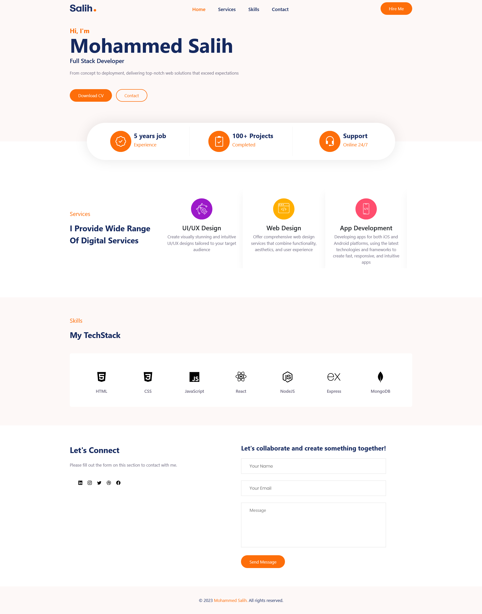

# React Portfolio

## Table of contents

  - [Screenshot](#screenshot)
  - [Built with](#built-with)
  - [What I learned](#what-i-learned)
  - [Useful resources](#useful-resources)
- [Author](#author)
- [Acknowledgments](#acknowledgments)


### Screenshot




### Built with

- ReactJS
- JSX
- JavaScript
- NPM
- Bootstrap
- Other node packages
- CSS custom properties
- Flexbox
- CSS Grid

### What I learned

```
<h1>I have gained knowledge about the fundamentals of React, as well as how to incorporate and utilize other npm packages.</h1>
```

### Useful resources

- [Bootstrap](https://getbootstrap.com/) - This helped me for creating a responsive website that provides a better user experience.
- [Boxicons](https://boxicons.com/) - This website offers a variety of icons that can be used for our project.
- [React-Multi-Carousel](https://www.npmjs.com/package/react-multi-carousel) - This is a lightweight fully customizable React carousel component which i used to showcase my services in this project.
- [Typewriter-Effect](https://www.npmjs.com/package/typewriter-effect) - This is a npm package for Typewriter effect.


## Author

- Website - [MOHAMMED SALIH KV](https://github.com/salih-kv)
- React Portfolio - [@react-portfolio](https://salih-kv.github.io/react-portfolio/)

## Acknowledgments

This is my first react project (A task by Entri Elevate BootCamp || React App Development ). I have completed this challenge by myself.
